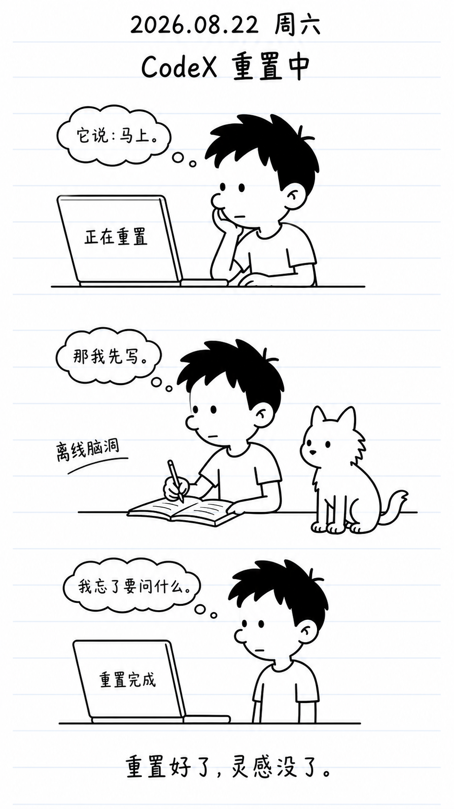
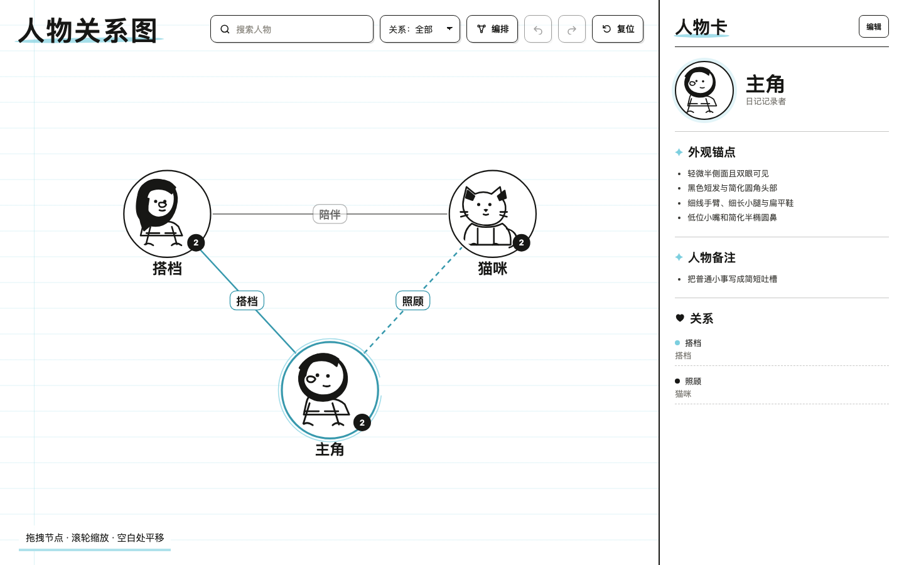

# 小屁孩日记风格 Skill

> 原创黑白幽默日记插画 Skill：把一天的经历整理成 9:16 竖版日记海报，并通过人物关系图保持角色和宠物前后一致。

本项目只提取黑白稚拙线描、日记纸、夸张动作和短对话等非专属特征，不复制任何已出版作品的具体角色、字体、页面或笑点。

## 这个 Skill 是什么

它适合在 Codex 中把文字、照片摘要、聊天记录或事件清单变成一页原创日记插画：

- 顶部包含日期、周几和日记标题。
- 画面为 9:16 竖版，从上到下讲述 3–6 个小场景。
- 统一使用黑白线稿和浅蓝单行本横线，不做写实渲染。
- 生成前检索人物关系图，复用已登记角色的头像、五官、头身比和服装锚点。
- 角色不在图谱中时，先请求补充图片，转绘入库后再继续生成。
- 提供可拖拽、可编辑、可自动编排的 HTML 人物关系图。

## 产出

- 9:16 黑白日记海报 PNG。
- 任务专用人物关系图 HTML。
- 角色图集和可复用的风格参考资产。
- 需要时，输出适配当前任务的分镜和短旁白建议。

## 30 秒安装

Skill 本身在 Codex 本地运行，不要求 Node.js。下面的 AI Agent 安装方式只需要本机能执行 `git`。

### 推荐：让 AI Agent 帮你安装

把下面这段话直接发给有本地终端权限的 AI Agent：

```text
请帮我安装 Codex Skill：
https://github.com/HoweTsui/cartoon-diary-journal

请按以下要求执行：
1. 安装到 ${CODEX_HOME:-$HOME/.codex}/skills/cartoon-diary-journal。
2. 如果目录已经存在，执行 git -C "${CODEX_HOME:-$HOME/.codex}/skills/cartoon-diary-journal" pull --ff-only；如果不存在，执行 mkdir -p "${CODEX_HOME:-$HOME/.codex}/skills"，再将仓库克隆到 "${CODEX_HOME:-$HOME/.codex}/skills/cartoon-diary-journal"。
3. 安装后确认目录中存在 SKILL.md、agents/、references/ 和 assets/。
4. 告诉我最终安装路径和检查结果。
```

也可以手动执行下面的等价命令：

```bash
skill_dir="${CODEX_HOME:-$HOME/.codex}/skills/cartoon-diary-journal"
if [ -d "$skill_dir/.git" ]; then
  git -C "$skill_dir" pull --ff-only
else
  mkdir -p "$(dirname "$skill_dir")"
  git clone https://github.com/HoweTsui/cartoon-diary-journal.git "$skill_dir"
fi
```

### 可选：使用 Skills CLI

只有选择这种安装器时才需要 Node.js 和 npm：

```bash
npx skills add https://github.com/HoweTsui/cartoon-diary-journal \
  --skill cartoon-diary-journal \
  --agent codex \
  --global
```

检查或更新：

```bash
npx skills list --global
npx skills update cartoon-diary-journal --global
```

## 安装后怎么用

在 Codex 中直接说：

```text
Use $cartoon-diary-journal
把下面这段经历整理成一页日记海报：
日期：2026-08-22
标题：CodeX 重置中
内容：我等待重置时先写日记，猫咪在旁边踩乱了纸张。
```

也可以直接附上照片、聊天记录或事件清单。Skill 会先确认日期、出场角色和人物图谱，再开始生成。

## 工作流程

1. 提取日期、标题、3–6 个事件和每个事件的出场角色。
2. 检查角色是否存在于当前人物关系图和头像图集。
3. 已存在的角色直接复用其风格与外观锚点。
4. 缺失角色先请求图片，统一转绘后补入图谱。
5. 生成由上至下排列的 9:16 日记海报。
6. 检查日期、人物一致性、五官完整性、线条、色彩和文字后交付。

## 画面规则

- 黑白中粗墨线、纯白纸面、低噪点；只允许浅蓝单行本横线。
- 顶部固定 `YYYY.MM.DD 周X`，下一行放标题。
- 人物采用轻微半侧面，必须看见两只圆形豆豆眼。
- 脸部外轮廓平滑，不出现折点、直角或硬转折。
- 鼻子根据人物特征变化，不统一成长鼻；嘴巴低于鼻子。
- 手臂极细、手掌略大但小巧；小腿细长，鞋子偏大偏扁。
- 动物保留物种结构，但不画写实毛发、阴影或眼睛高光。
- 猫鼻小而黑，位于两眼下方中央；狗鼻为口鼻前端的单个黑色椭圆。
- 不使用彩色毛色块、渐变、灰色阴影、纸张噪点或四格漫画边框。

## 人物关系图

关系图是全局角色参考，不按日期组织。浏览态只显示纯文本；点击“编辑”后可：

- 拖拽节点和空白画布。
- 从控制点吸附建立关系，拖出端点断开关系。
- 双击连线名称修改关系，Enter 保存，Escape 取消。
- 使用一键智能编排、撤销和重做。

创建实际任务图谱时，使用模板填写真实角色和关系：

```bash
python3 scripts/build_character_graph.py \
  /path/to/actual-character-data.json \
  --output /path/to/task-output/character-graph.html
```

## 示例

### 日记海报



### 人物关系图谱



[打开人物关系图谱示例 HTML](assets/style-reference/character-graph-demo.html)

## 目录

```text
cartoon-diary-journal/
├── SKILL.md                 # Skill 主规则
├── agents/openai.yaml       # Agent 显示信息
├── references/              # 风格、版式、图库、隐私与 QA 规则
├── scripts/                 # 图谱构建等辅助脚本
└── assets/
    ├── style-reference/     # 公开示例与风格参考
    └── templates/            # 任务数据模板
```

## 适用范围

适合：

- Codex 中的个人日记、生活记录和连续角色故事。
- 需要长期保持人物、宠物和画面风格一致的插画任务。
- 喜欢黑白、低噪点、手绘线稿和简短叙事的人。

不适合：

- 写实人像、摄影风、三维渲染或复杂彩色插画。
- 复制已出版作品的具体角色、字体、页面或构图。
- 需要逐像素编辑的矢量插画或商业品牌主视觉。

## 许可与本地运行

代码与文档沿用仓库中的 MIT 许可。Skill 安装后在用户本机运行，读取的输入、人物图谱和生成的海报默认保存在本地工作区；用户可以自行决定是否导出或分享这些文件。
