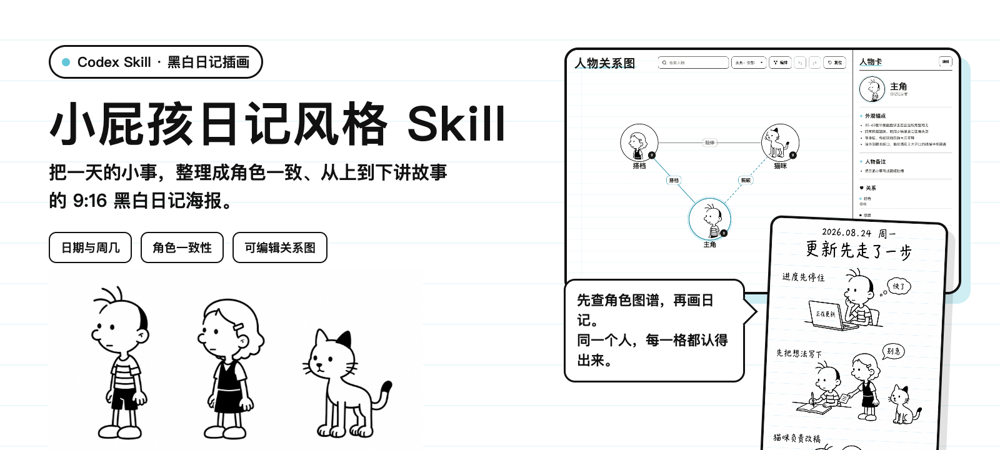

<p align="center">
  
</p>

<p align="center">
  <strong>把一天的小事，画成角色一致、从上到下讲故事的 9:16 黑白日记海报。</strong>
</p>

<p align="center">
  <a href="LICENSE"></a>
  
  
</p>

本项目是一套原创黑白幽默日记插画 Skill。它会先检索人物关系图，再根据日记内容生成海报，让同一人物和宠物在连续页面中保持一致。

> 只提取黑白稚拙线描、日记纸、夸张动作和短对话等非专属特征，不复制已出版作品的具体角色、字体、页面或笑点。

## 先看效果

### 日记海报

<p align="center">
  
</p>

### 可编辑人物关系图


浏览态用于查看人物卡和关系；点击“编辑”后可拖拽节点、建立或断开连线、修改关系名称、自动编排、撤销和重做。

[打开可交互示例 HTML](assets/style-reference/character-graph-demo.html)

## 能做什么

| 日记编排 | 角色一致性 | 人物关系图 |
| --- | --- | --- |
| 日期、周几、标题和 3–6 个纵向场景 | 复用头像、五官、比例、服装与宠物锚点 | HTML 节点拖拽、关系编辑与智能编排 |
| 每格短总结和少量对话气泡 | 新角色先转绘入库，再生成日记 | 支持增删角色、修改详情和导出数据 |

主要产出：

- 9:16 黑白日记海报 PNG。
- 任务专用人物关系图 HTML。
- 角色图集和可复用身份锚点。

## 安装

### 推荐：让 AI Agent 安装

把下面这句话发给有本地终端权限的 AI Agent：

```text
请安装这个 Codex Skill，并在安装后检查 SKILL.md 是否存在：
https://github.com/HoweTsui/cartoon-diary-journal
```

Agent 应安装到：

```text
${CODEX_HOME:-$HOME/.codex}/skills/cartoon-diary-journal
```

### Skills CLI

```bash
npx skills add HoweTsui/cartoon-diary-journal --skill cartoon-diary-journal --agent codex --global
```

只有使用 `npx skills` 安装器时才需要 Node.js；Skill 本身不依赖 Node.js。

### 手动安装

```bash
skill_dir="${CODEX_HOME:-$HOME/.codex}/skills/cartoon-diary-journal"
if [ -d "$skill_dir/.git" ]; then
  git -C "$skill_dir" pull --ff-only
else
  mkdir -p "$(dirname "$skill_dir")"
  git clone https://github.com/HoweTsui/cartoon-diary-journal.git "$skill_dir"
fi
```

## 第一次使用

在 Codex 中直接说：

```text
Use $cartoon-diary-journal
把下面经历整理成一页 9:16 黑白日记海报：
日期：2026-08-24
标题：更新先走了一步
内容：电脑更新时，我先把零散想法写进日记，猫咪踩乱了一张纸。
```

也可以附上照片、聊天记录或事件清单。Skill 会先确认日期、出场角色和人物图谱，再开始生成。

## 工作方式

```text
日记内容
   ↓
检索人物关系图和角色图集
   ├─ 已存在：复用身份锚点
   └─ 不存在：请求参考图 → 统一转绘 → 补入图谱
   ↓
生成 9:16 纵向日记海报
   ↓
检查日期、角色、五官、肢体、文字和色彩
```

## 核心画面规则

- 纯黑白中粗墨线、纯白纸面；只允许浅蓝单行本横线。
- 顶部固定 `YYYY.MM.DD 周X`，下一行放标题；正文按 3–6 个场景从上到下排列。
- 人物和动物统一采用 35°–45° 半侧面，必须看见两只同尺寸正圆豆豆眼；禁止正面和单眼正侧面。
- 人脸轮廓平滑；前外侧眼旁从发际高度到鼻根保留长断口，不画眉毛或鼻梁。
- 人物鼻使用上方开口、不填黑的线描半椭圆；动物使用物种正确的实心黑鼻，两者不能互换。
- 身板窄，上臂、前臂、大腿和小腿保持极细；手掌略大，鞋子偏大偏扁。
- 动物四肢极细、爪掌略大，不画写实毛发、阴影或眼睛高光。
- 每场使用 4–10 字短总结；相邻场景保留明显空白。气泡只放 1–6 字短反应，整页最多 3 个。

完整规范见 [SKILL.md](SKILL.md) 与 [references/](references/)。

## 人物关系图

关系图是全局角色参考，不按日期组织。生成实际任务图谱时，先填写任务数据，再构建 HTML：

```bash
python3 scripts/build_character_graph.py \
  /path/to/actual-character-data.json \
  --output /path/to/task-output/character-graph.html
```

## 项目结构

```text
cartoon-diary-journal/
├── SKILL.md                 # Skill 主规则
├── agents/openai.yaml       # Agent 显示信息
├── references/              # 风格、版式、图库与 QA 规则
├── scripts/                 # 图谱构建和辅助脚本
└── assets/
    ├── readme/              # README 封面素材
    ├── style-reference/     # 公开示例与风格参考
    └── templates/           # 任务数据模板
```

## 适用范围

适合个人日记、生活记录和连续角色故事；不适合写实人像、摄影风、三维渲染、复杂彩色插画，或复刻已出版作品的具体角色与页面。

## License

[MIT](LICENSE)
