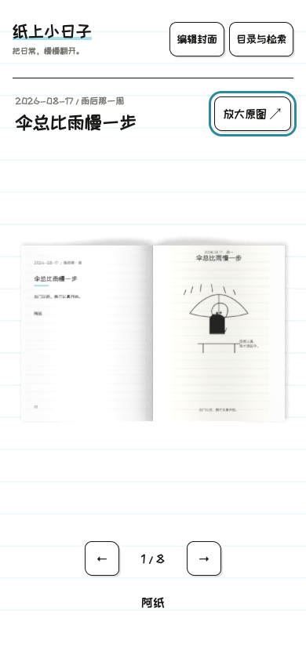

<p align="center">
  
</p>

<p align="center">
  <strong>把一天的小事，画成角色一致、从上到下讲故事的 3:4 黑白日记海报。</strong>
</p>

<p align="center">
  <a href="LICENSE"></a>
  
  
</p>

本项目是一套原创黑白幽默日记插画 Skill。它会复用现有人物图谱；新角色先制作预览并确认身份，再根据日记内容生成海报，让同一人物和宠物在连续页面中保持一致；已验收的连续海报还能汇编成完全离线的可翻页日记本。

> 只提取黑白稚拙线描、日记纸、夸张动作和短对话等非专属特征，不复制已出版作品的具体角色、字体、页面或笑点。

## 最近更新

- **v0.3.1**：恢复封面、演示与完整使用说明，新增新版日记本桌面和手机截图；不修改运行逻辑。
- **v0.3.0**：更新角色几何、场景表情和身份确认流程，保留完整日记原文；加入手写 3D 翻页日记本。

完整逐版说明见 [CHANGELOG.md](CHANGELOG.md)。

## 先看效果

以下人物、海报和封面采用历史公开虚构示例，用于展示版式，不作为当前角色几何或身份审批依据。

### 新版手写 3D 日记本


<p align="center"></p>

新版提供手写字体、可编辑书名、可替换图片的花瓣蒙版封面、目录搜索、阅读进度与原图放大。手机保留完整双页，细字可通过“放大原图”阅读。海报不裁切、不重画。

在仓库根目录运行公开 Demo：

```bash
python3 scripts/build_diary_reader.py assets/diary-book/demo/index.html --output-dir task-output/reader-v3-demo
python3 -m http.server 8000 --bind 127.0.0.1 --directory task-output/reader-v3-demo
```

打开 <http://127.0.0.1:8000/>。新版必须使用本地 HTTP，不能双击 HTML；输出目录须是新的目录。运行时和字体随包提供，无需联网下载。详见 [新版阅读器说明](references/diary-reader-v3.md)。


### 日记海报

<p align="center">
  
</p>

### 可编辑人物关系图


浏览态用于查看人物卡和关系；节点优先加载各自独立的 1:1 上半身头像并居中，整张图集只作总览和旧数据兜底。点击“编辑”后可拖拽节点、建立或断开连线、修改关系名称、自动编排、撤销和重做。

[打开可交互示例 HTML](assets/style-reference/character-graph-demo.html)

### 旧版离线日记本（保留兼容）

<p align="center">
  
</p>

日记本保持每张海报的原始比例完整显示：新海报采用 3:4，历史 9:16 海报使用 `contain` 置入 3:4 书页，不裁切、不拉伸。翻页舞台使用白纸、浅青横线、黑墨线和轻量装订感；封面采用彩色书皮、撕纸蒙版和独立可编辑标题，不复制已出版作品的角色、Logo 或字体。日记页不重复叠加日期和标题，只在页脚显示摘要、标签和页码；同时提供桌面双页、手机单页、目录、日期/标题/标签/角色搜索、`#entry` 深链和按日记 ID 恢复的本地阅读进度。书内人物卡与只读关系概览会跳转到独立人物图谱，并通过 `?character=<角色ID>` 自动选中节点；不把图谱 Canvas 嵌入翻页页。

[打开虚构离线 Demo](assets/diary-book/demo/index.html)（下载或克隆仓库后直接用浏览器打开）

## 能做什么

| 日记编排 | 角色一致性 | 人物关系图 |
| --- | --- | --- |
| 居中日期/周几、居中标题和 1–4 个纵向场景 | 复用头像、五官、比例、服装与宠物锚点 | HTML 节点拖拽、独立 1:1 头像、关系编辑与智能编排 |
| 固定字号的右侧场景备注和少量对话气泡 | 新角色先转绘入库，再生成日记 | 支持增删角色、修改详情和导出数据 |

主要产出：

- 3:4 黑白日记海报 PNG（历史 9:16 海报仅作兼容）。
- 任务专用人物关系图 HTML（每个节点优先读取独立 1:1 上半身头像并居中显示）。
- 角色图集和可复用身份锚点。
- 本地私有的离线可翻页日记本 HTML（每日海报不裁切、不重排）。

## 安装

### 推荐：让 AI Agent 安装

把下面这句话发给有本地终端权限的 AI Agent：

```text
请安装这个 Codex Skill，并在安装后检查 SKILL.md 是否存在：
https://github.com/HoweTsui/cartoon-diary-journal
```

Agent 应安装到：

```text
${CODEX_HOME:-$HOME/.codex}/skills/cartoon-diary-journal
```

### Skills CLI

```bash
npx skills add HoweTsui/cartoon-diary-journal --skill cartoon-diary-journal --agent codex --global
```

Python 构建脚本使用 Python 3.8+；使用已打包日记本无需 Node.js，Skills CLI 安装及前端源码重建需要 Node.js。

### 手动安装

```bash
skill_dir="${CODEX_HOME:-$HOME/.codex}/skills/cartoon-diary-journal"
if [ -d "$skill_dir/.git" ]; then
  git -C "$skill_dir" pull --ff-only
else
  mkdir -p "$(dirname "$skill_dir")"
  git clone https://github.com/HoweTsui/cartoon-diary-journal.git "$skill_dir"
fi
```

## 第一次使用

在 Codex 中直接说：

```text
Use $cartoon-diary-journal
把下面经历整理成一页 3:4 黑白日记海报：
日期：2026-08-24
标题：更新先走了一步
内容：电脑更新时，我先把零散想法写进日记，猫咪踩乱了一张纸。
```

也可以附上照片、聊天记录或事件清单。Skill 会先确认日期、出场角色和人物图谱，再开始生成。

## 工作方式

```text
日记内容
   ↓
检索人物关系图和角色图集
   ├─ 已存在：复用身份锚点
   └─ 不存在：请求参考图 → 统一转绘 → 补入图谱
   ↓
每名角色生成独立 1:1 头像 → 拼成完整总览图集
   ↓
生成 3:4 纵向日记海报
   ↓
检查日期、角色、五官、肢体、文字和色彩
   ↓
可选：汇编为离线可翻页日记本
```

## 核心画面规则

- 黑白墨线、白纸和浅青横线；日期与标题居中，1–4 个场景从上到下排列，短备注放在右侧。
- 人类采用细肢体、正圆小眼、横向开放鼻和低位分离嘴；表情随场景变化，轻中度表情不画眉。
- 动物保持无毛轮廓、短细腿与大爪；猫的每格表情保留独立黑鼻。
- 原文完整保存，Agent 另写标题和场景短文本；构建器不截断原文、不按关键词猜测情绪。
- 当前数值统一见 [geometry.json](references/geometry.json)，完整规范见 [SKILL.md](SKILL.md)；历史图片不覆盖当前规范。

### 输入与预览

v0.3 使用 [Schema v2](references/prompt-template.md)。旧 brief 需迁移，明确 `sourceText`、`protagonistId`、`species`、场景表情与身份审批状态。任务放在已忽略的 `task-output/` 中，图片路径相对 brief 所在目录。测试预览不自动成为正式身份批准。

```bash
python3 scripts/build_diary_prompt.py task-output/brief.json --preview --output task-output/prompt.txt
python3 scripts/preflight_check.py --brief task-output/brief.json --preview
```

程序检查不能代替出图后的视觉验收。

## 人物关系图

关系图是全局角色参考，不按日期组织。生成实际任务图谱时，先填写任务数据，再构建 HTML：

每名角色先生成独立的 1:1 方形上半身 PNG 或 SVG，并在节点中填写唯一的 `avatarSrc`（相对 HTML 路径）；再按相同顺序拼成 `character-lineup.png` 或 `.svg` 总览图。HTML 节点和人物卡会以中心对齐优先读取独立头像，旧数据才回退图集裁切。`?character=<角色ID>` 可让图谱自动选中并居中指定人物。

```bash
python3 scripts/build_character_graph.py \
  /path/to/actual-character-data.json \
  --output /path/to/task-output/character-graph.html
```

## 构建旧清单并导入新版

真实清单、角色头像、图谱、海报和输出都保留在 Git 忽略的 `task-output/`。日记本不裁切、不重排已有海报；新海报为 3:4，历史 9:16 海报完整放入 3:4 书页。构建时会复制固定的本地翻页运行时，因此不需要网络、CDN 或服务端。

```bash
python3 scripts/build_diary_book.py \
  task-output/diary-book/diary-book-data.local.json \
  --graph task-output/diary-book/character-graph.html \
  --output task-output/diary-book/index.html
```

数据字段、时期规则、隐私边界和验收标准见 [diary-book-system.md](references/diary-book-system.md)。公开虚构 Demo 可用 `--public-demo` 重建，真实内容不能使用该参数。

将上面的旧日记本导入新版（保留旧本与原海报）：

```bash
python3 scripts/build_diary_reader.py task-output/diary-book/index.html --output-dir task-output/my-reader-v3
```

再按上方 Demo 的方式启动本地 HTTP 服务。封面上传仅保存在当前浏览器，不修改导出文件。导入限制与源码重建见 [新版阅读器说明](references/diary-reader-v3.md)。

## 项目结构

```text
cartoon-diary-journal/
├── SKILL.md                 # Skill 主规则
├── agents/openai.yaml       # Agent 显示信息
├── references/              # 风格、版式、图库与 QA 规则
├── scripts/                 # 图谱、提示词、日记本构建和辅助脚本
└── assets/
    ├── diary-reader-v3/     # 新版源码、运行时、字体与许可
    ├── diary-book/          # 本地翻页运行时与虚构 Demo
    ├── readme/              # README 封面素材
    ├── style-reference/     # 公开示例与风格参考
    └── templates/           # 任务数据模板
```

## 适用范围

适合个人日记、生活记录和连续角色故事；不适合写实人像、摄影风、三维渲染、复杂彩色插画，或复刻已出版作品的具体角色与页面。

## License

[MIT](LICENSE)
