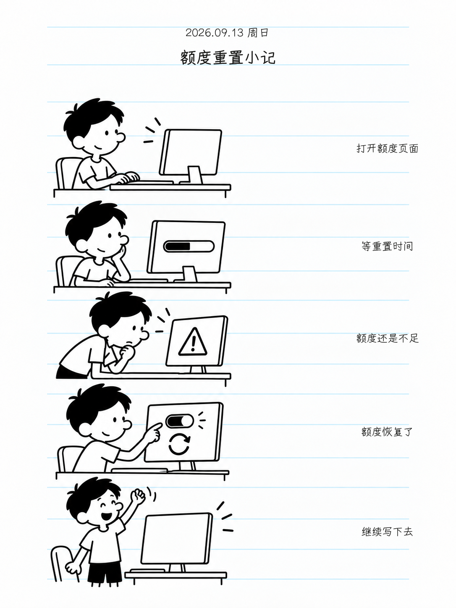
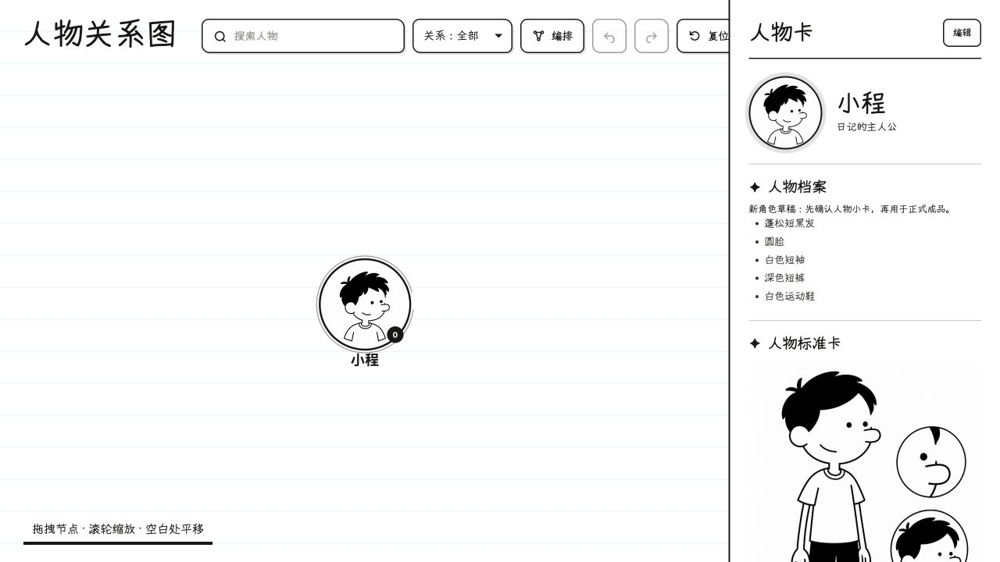

# 小屁孩日记

把你的文字和照片，整理成一篇带插画的日记。

这是给 **Codex 等支持 Skill 的 AI 助手**使用的日记工具。你提供日期、经历和照片，它帮你整理正文、画出黑白海报、记录人物关系，把每天的作品收进可翻页的日记本。它不是独立 App，生成插画需要助手具备图片生成能力。

## 会得到什么？

| 成品 | 有什么用 | 怎么看 |
| --- | --- | --- |
| 日记文档 | 轻润色的正文，直接嵌入完整海报和照片宫格 | 在指定的笔记或文档工具中打开 |
| 日记海报 | 一天一张，1–5 个场景，附日期、标题和备注 | 直接打开 PNG，保存或分享 |
| 人物形象卡与关系图 | 记住你、朋友和宠物的外貌与关系 | 打开关系图 HTML，点击人物查看 |
| 可翻页日记本 | 按日期收藏海报，可翻页、搜索、放大 | 让助手打开日记本预览链接 |
| 照片与附件 | 保留原图、压缩照片和高清海报 | 在日记附件目录中查看 |

## 先看效果

### 一天，一张海报

这篇记录的是 **Codex 额度用完、等待重置、恢复后继续任务**。右侧备注对应每个场景，文字统一使用随包提供的悠哉字体。

<p align="center"></p>

白纸、黑色线条、浅青横线，保留充足留白。新人物先出形象卡，你确认后，后续日记继续复用。

### 连起来，就是一本日记


<p align="center"></p>

可以翻页、按日期或内容搜索，点击“放大原图”看细节。设备不支持 3D 时，以完整平面海报阅读；原图不会被裁掉。

### 记住每一个角色



首次加入人物或宠物，告诉助手名字、关系并提供照片。先确认人物形象卡，再用于正式日记；已有角色不用每天重新确认。关系图只记录你提供的关系。

## 怎么开始？

### 1. 安装一次

把这段话发给有本地文件权限的 Codex：

```text
请安装这个 Skill，并检查所需依赖是否齐全：
https://github.com/HoweTsui/cartoon-diary-journal
```

安装后新开一个任务使用。如果助手无法生成图片，需要先启用图片生成工具；照片处理和 PNG 导出需要 Python 与 Pillow，可让助手一并检查。

### 2. 给出日期、经历和照片

复制下面这段，换成你的内容并附上照片：

```text
使用 $cartoon-diary-journal 帮我写一篇日记。

日期：2026-09-13
内容：今天 Codex 额度用完了，等重置有点着急。
额度恢复以后，终于能接着做没完成的任务。

人物：我。已有形象卡就继续使用。
照片：按我上传的顺序放入日记正文的三列宫格。
保存位置：我的日记文件夹（或指定笔记工具与页面）。

正文可以轻润色，但不要改变我的意思。
请把完整海报嵌入正文，并更新人物关系图和日记本。
```

不用提前写标题、拆场景或学习代码。重要的话、情绪或细节，可以明确说“这句请保留”。没有照片时可以先用已有角色；新角色缺少信息时，助手会向你补问。

### 3. 确认形象与成品

新角色先确认人物形象卡。随后看海报：人物像不像、事情有没有画对、文字有没有偏离原意。需要改哪里，直接说即可。

确认后，助手会把成品放进指定位置。使用笔记或文档工具时，需要该工具已连接并有写入权限。

## 日记保存在哪里？

每篇按日记日期命名，例如 **2026-09-13**。打开后依次看到：

1. **日记内容**：轻润色，保留你的事实、态度和情绪。
2. **完整海报**：包含日期、标题和备注的 PNG，直接显示在正文。
3. **原照片**：全部按上传顺序，以压缩件排成三列，不裁切；最后一行不足三张也正常显示。

支持三列布局的工具使用原生图片排列；不支持时嵌入一张宫格图，同时保留单张附件。照片保留本来的颜色，黑白画风只用于插画。原件也会保留，压缩后检查异常变黑、方向错误或严重失真。

海报高清版与正文用压缩版都会保存。当天已有日记时，保留原有内容并补充，避免重复建一篇。

## 怎样打开日记本？

直接告诉助手：

```text
请打开我的日记本，让我查看最新一篇，并提供可放大的海报原图。
```

新版日记本通过本机预览地址打开，不能直接双击入口 HTML，助手会帮你启动预览。人物关系图和普通日记 HTML 可以本地打开。GitHub 上的 HTML 链接只显示文件内容，需要下载后查看。

<details>
<summary>想自己打开公开日记本示例？</summary>

下载仓库，在仓库文件夹运行以下两行（输出文件夹需尚未存在）：

```bash
python3 scripts/build_diary_reader.py assets/diary-book/demo/index.html --output-dir task-output/reader-demo
python3 -m http.server 8000 --bind 127.0.0.1 --directory task-output/reader-demo
```

打开 [本机预览](http://127.0.0.1:8000/)。保持终端运行即可阅读，结束时按 Ctrl+C。旧公开日记用于体验翻页功能；本文截图展示新版示例。

</details>

## 常见问题

**会把内容改得面目全非吗？** 只做轻润色和必要提炼；完整原文保留，不新增经历、不夸大情绪、不强行升华。预览时请确认是否表达了你的意思。

**换电脑会缺字体吗？** 悠哉字体随 Skill 提供，无需单独安装；照片和日记附件也要一起迁移，才能继续预览。

**照片会发到 GitHub 吗？** 日记和原照片保存在指定位置，不应随 Skill 发布。生成插画时，参考照片会交给你使用的图片生成服务，请按该平台管理隐私。

**怎么更新？** 告诉助手“将 cartoon-diary-journal 更新到 GitHub 最新版本，保留我的日记、照片和人物资料”。

## 最近更新 · v0.3.5

- 完整海报直接嵌入正文，照片按顺序三列展示。
- 保留原图，检查压缩后变黑、方向与画质问题。
- 日记和海报更重视原意，支持直接导出悠哉字体 PNG。

[更新记录](CHANGELOG.md) · [Skill 规则](SKILL.md) · [日记入库说明](references/diary-document.md)

代码采用 [MIT](LICENSE)；字体及日记本组件遵循各自随附许可。示例为虚构内容，采用原创黑白日记插画，不复制已出版作品的具体角色或页面。
